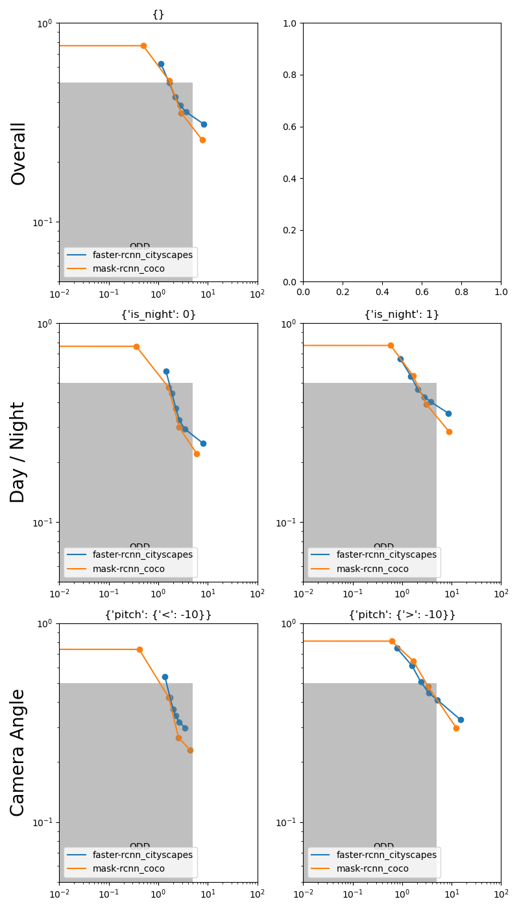

# Pedestrian Detection Sensitivity Analysis

This project performs inference of baseline detection methods on datasets, both synthetic and real, and performs a sensitivity analysis on the results.

Given input detection models (RGB --> (x0,y0,x1,y1) it aims at :
- Analyzing their sensitivity toward parameters such as 
  - frame parameters (luminosity, weather, camera angle, camera distance)
  - boundig box parameters (height, occlusion)
- Provide an exhaustive benchmark on MoTSynth and EuroCityPerson datasets to make a proof of concept of the method, yielding empirical results indicating what works and what does not work in the synthetic dataset.

## How to use this project

Assuming each twincity folder is stored in `/home/raphael/work/datasets/twincity-Unreal/v5` :

Run `python main.py -d twincity -r /home/raphael/work/datasets/twincity-Unreal/v5 --max_samples 50 -output results_new -frame -gt --plot_image`

## Datasets used 

dataset named as : ($name_$max samples)

| characteristics       | motsynth_600                                                              | twincity_50            | EuroCityPerson_30   |
|:----------------------|:--------------------------------------------------------------------------|:-----------------------|:--------------------|
| sequences (day/night) | 24/10                                                                     | 2/2                    | 31/7                |
| images (day/night)    | 404/170                                                                   | 70/100                 | 826/164             |
| person (day/night)    | 12096/5365                                                                | 1378/1835              | 5604/1182           |
| weather               | THUNDER, CLEAR, SMOG, EXTRASUNNY, FOGGY, CLOUDS, BLIZZARD, RAIN, OVERCAST | Partially cloudy, Snow | dry, rainy          |

- Download motsynth
- Download eurocityperson (research purpose only) 

For more information on EuroCityPerson and its license see https://eurocity-dataset.tudelft.nl/  
For more information on MoTSynth and its license see https://aimagelab.ing.unimore.it/imagelab/page.asp?IdPage=42  

## Results 

|                                                                                                                             | Twincity (Synthetic)                                                                                                                                                                                         | MoTSynth (Synthetic)                                                                        | EuroCityPerson (Real)                                                                              |
|-----------------------------------------------------------------------------------------------------------------------------|--------------------------------------------------------------------------------------------------------------------------------------------------------------------------------------------------------------|---------------------------------------------------------------------------------------------|----------------------------------------------------------------------------------------------------|
| Boundig Box parameter sensitivity : MR vs FPPI for bbox aspect ratio (line 1), height (line 2) and occlusion rate (line 3). |                                                                                                                  |  |  |
| Frame parameter sensitivity :  MR vs FPPI for Day vs Night (line 2) and Camera Angle (line 3).                              |                                                                                                                                           |  |    |
| Frame parameter sensitivity : Missing Rate difference between specific scenario and average                                 |   ![Performance_difference_MR_['faster-rcnn_cityscapes', 'mask-rcnn_coco'].png](reference_results%2Ftwincity50%2FPerformance_difference_MR_%5B%27faster-rcnn_cityscapes%27%2C%20%27mask-rcnn_coco%27%5D.png) | ![Performance_difference_MR_['faster-rcnn_cityscapes', 'mask-rcnn_coco'].png](reference_results%2Fmotsynth600%2FPerformance_difference_MR_%5B%27faster-rcnn_cityscapes%27%2C%20%27mask-rcnn_coco%27%5D.png)| ![Performance_difference_MR_['faster-rcnn_cityscapes', 'mask-rcnn_coco'].png](reference_results%2FEuroCityPerson30%2FPerformance_difference_MR_%5B%27faster-rcnn_cityscapes%27%2C%20%27mask-rcnn_coco%27%5D.png)|