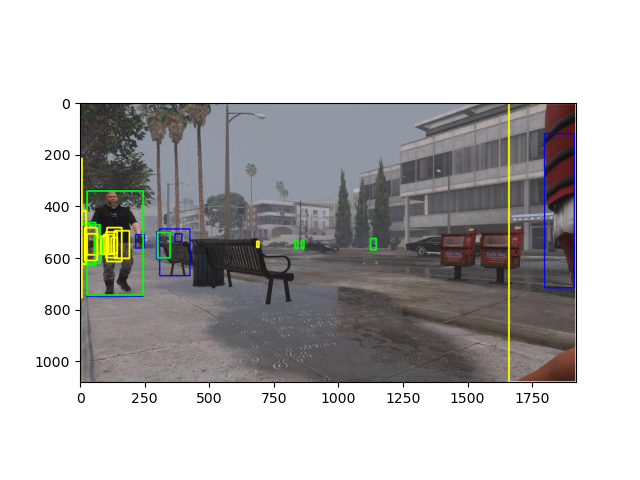
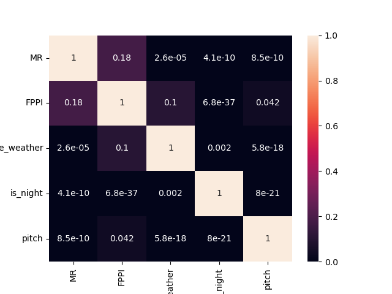
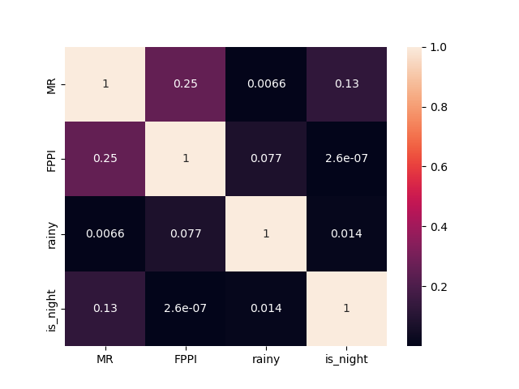
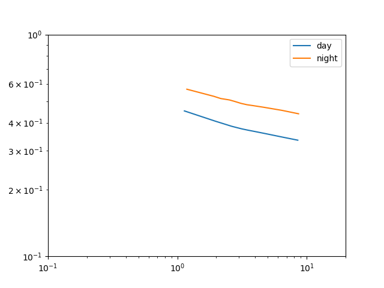
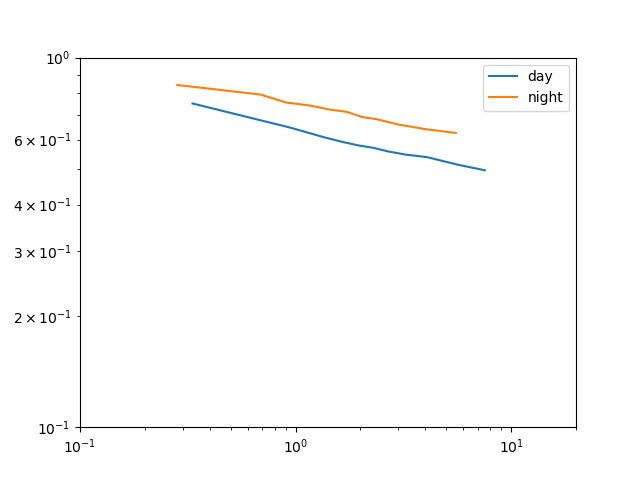

TODO
- master avec MoTSynth et Twincity
- factoriser code
  - classe dataset
- ignore regions of twincity that bug (bbox too big or multiple colors)

#todo df_analysis as a result object ?
#todo filter functions in the dataset ?

Download motsynth
Download eurocityperson

Run `python motsynth_demo.py`
Run `python ECP_demo.py`

For more information on MoTSynth and its license see https://aimagelab.ing.unimore.it/imagelab/page.asp?IdPage=42 
For more information on EuroCityPerson and its license see https://eurocity-dataset.tudelft.nl/ 

# Results

Study on a baseline (Faster-RCNN trained on Cityscapes) :

| Dataset                  | MoTSynth (Synthetic)                                                                            | EuroCityPerson (Real)                                                                                                                              |
|--------------------------|-------------------------------------------------------------------------------------------------|----------------------------------------------------------------------------------------------------------------------------------------------------| 
| Img example              |              |  |
| pval or correlation test |                |                                                                  |
| Day vs Night             |  |                                                            |

pval indicates statstical significance for night/day for both MR and FPPI, and weather for MR.

We plot an example of performance for the baseline, in either day or night scenes in both datasets. Performance are worse at night.

# Install
conda install pytorch==1.12.1 torchvision==0.13.1 torchaudio==0.12.1 cudatoolkit=11.3 -c pytorch
torchmetrics
tqdm
pandas
seaborn
conda install -c conda-forge opencv
This post did help https://discuss.pytorch.org/t/userwarning-cuda-initialization-cuda-unknown-error-this-may-be-due-to-an-incorrectly-set-up-environment-e-g-changing-env-variable-cuda-visible-devices-after-program-start-setting-the-available-devices-to-be-zero/129335/2

scikit-learn

cpu conda install pytorch torchvision torchaudio -c pytorch

See mmdet / mmcv for install

