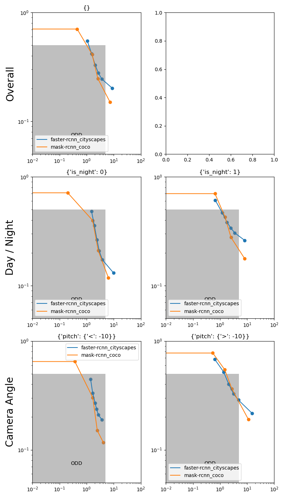

# Pedestrian Detection Sensitivity Analysis : An experiment to explore the potential of synthetic data for evaluating pedestrian detection

## I Introduction

| Real Data                                                                                                                                              | Synthetic Data (Twincity)                                                                                                                                                | 
|--------------------------------------------------------------------------------------------------------------------------------------------------------|--------------------------------------------------------------------------------------------------------------------------------------------------------------------------|
|                                                             |  |
| Bercy parc in Paris. Photo from [Wikipedia](https://fr.wikipedia.org/wiki/Parc_de_Bercy#/media/Fichier:Cascade_du_parc_de_Bercy,_Paris_2017_001.jpg).  | A synthetic scene of a Parc in Twincity. Unreal Engine 5 offer a photorealistic rendering of urban sceene, allowing to explore the use of AI detection algorithms.

### I.1 Context

This work is part of the Entrepreneur d'Interet General (EIG) program, at the SDITN of 
the French Ministry of Interior.

Keywords : *AI, Game-Engine, Synthetic Data, Pedestrian Detection, Object Detection, Sensitivity Analysis, Evaluation.*

### I.2 Motivation

- Low luminosity, adverse weather conditions, occlusion or camera angle are factors that can affect the performance 
of pedestrian detection methods. To what extent ?  
- How fast an AI-system would detect a 
[crowd accident](https://en.wikipedia.org/wiki/List_of_fatal_crowd_crushes#2020s) ?  
- Is an AI discriminative ? 

These are the types of questions that arise at the Datalab of the SDTIN french Ministry of Interior, as the
use of AI-systems for public safety has just been authorized by the [french law](https://www.assemblee-nationale.fr/dyn/16/textes/l16b0809_projet-loi#), and is currently discussed 
at the European level, with the [European Artificial Intelligence Act](https://artificialintelligenceact.eu/).

In the **Twincity project**, we intend to provide first insights on these issues by : 

- taking a step back and leverage synthetic data generated via a game engine (Unreal Engine)
  - by analogy with the Autonomous Driving field, 
  where it is widely used for training and evaluation.
  - because recent progress of these engines lead to convincing photorealistic images and videos.
- focusing on the pedestrian detection task, as 
  - it is well studied in the litterature 
  (especially autonomous driving), numerous datasets are available, 
  - it is no different from any other Object Detection (OD) task. 
  - annotations are more granular with bounding boxes (e.g. more than crowd counting with a point per person) 
allowing finer analysis (e.g. study the influence of occlusion, height, etc.)
  - it is relevant for the Ministry of Interior use-cases.

To this end we first reduce the scope the project to answer the following question : 

**Can we use synthetic data to evaluate pedestrian detection methods ?**  
which we split in two sub-questions :
- 1. Using SoTA Synthetic Dataset : is it doable in theory ?
- 2. Using a custom synthetic dataset : is it doable in practice ?

**Why do we intend to answer the feasability and usefullness of building a custom synthetic dataset ?**  
Because if successfull :
- It would allow us to build datasets that are **tailored to our needs** (e.g. for the Ministry of Interior use-cases, such as image blurring), which is often 
hard to find in real datasets publicly available when working on niche applications.
- It would allow us to **control the characteristics of the data** (e.g. occlusion, weather, camera angle, etc.) 
- It would allow to **centralize on a common dataset** the evaluation of pedestrian detection methods . 
It is very hard to find a publicly available dataset that correspond both to the desired use-case, 
as well as having the needed level of exhaustivity. For example EuroCityPerson and NightOwls aim at exhaustivity on day/night as well
As weather conditions, but the camera angle is always the same due to their Autonomous Driving application.
- Compared to real data, it is **easier to generate** (e.g. no need to label the data, no need to find a location, etc.), and 
do not require any **privacy concern** (e.g. blurring faces, license plates, etc.).
- It allows to anticipate and better target the acquisition of real data (e.g. by focusing on the most challenging scenarios), 
by nature sensitive, and costly to acquire and annotate.

In addition, there are other potential benefits : 
 - Possible **synergies for comptuter vision dataset building** (especially in 3D assets) 
 - A fully controlled dataset could be used to **exhibit potential biases** of AI solutions, such as discriminations that are 
explicitely pointed out in the [EU AI White Paper](https://commission.europa.eu/publications/white-paper-artificial-intelligence-european-approach-excellence-and-trust_en) as well 
as in the [JO 2024 Project of Law](https://www.assemblee-nationale.fr/dyn/16/textes/l16b0809_projet-loi#).

To test the hypothesis of questions 1. and 2., we perform a benchmark of baseline 
pedestrian detection methods on specific datasets and scenarios, detailed in the **Benchmark section**.
In short, we propose a sensitivity analysis, by correlating metrics of performance with characteristics of the data (e.g. occlusion rate, weather, etc.).
We then look at what parameter influence the most the performance, in what cases.

|  | Day    | Night  |
|-------------------------------------------------------------------------|--------|--------|
| CCTV view                                                               |  |  |
| Bird's eye view                                                         |  |  |

> Example of randomization of a given scenario (luminosity, camera angle).

### I.3 The Task of Pedestrian Detection

#### I.3.1 Task description

The task of Pedestrian Detection (PD) is a specific case of Object Detection (OD) where the object of interest is a pedestrian.

From an image or a video (e.g. 1920x1080), the goal is to detect all pedestrians, and localize each pedestrian $i$ with a bounding box $B_i=(x0, y0, x1, y1)$.

Model typically output a score $p_i$ (between 0 and 1) for each bounding box $B_i$ that is a measure of confidence that the bounding box $B_i$ contains a pedestrian.

Therefore, from a model output, we can define a threshold $t$ (between 0 and 1) that will be used to filter out bounding boxes with a score $p_i$ below $t$.

| Pedestrian detection in Twincity | Day   | Night                                                                                                                                                                              |
|----------------------------------|-------|------------------------------------------------------------------------------------------------------------------------------------------------------------------------------------|
| CCTV view                        | |    |
| Bird's eye view                  |  |                                                                                            |

> Prediction for a given pedestrian detection model on the generated synthetic data. We can see that in Bird's eye view the model miss most of the pedestrians.

(TODO image with model U takes image X and predict BBoxes with scores, which are filtered with a threshold t to get the final prediction)
(This is to be compared to ground truths bounding boxes).

#### I.3.2 Metrics for the Task of Pedestrian Detection

Matching the Bounding Boxes
- **IoU** : Intersection over Union, is a measure of the overlap between two bounding boxes (typically, a threshold of 0.5 is used to consider a prediction as a true positive).

| Metrics of detection in Twincity | Day                                                                                              | Night                                                                                                                                                                             |
|----------------------------------|--------------------------------------------------------------------------------------------------|-----------------------------------------------------------------------------------------------------------------------------------------------------------------------------------|
| CCTV view                        |  |  |
| Bird's eye view                  |                                                                                                  |                                                                                       |

Computing Metrics over matched Bounding Boxes
- **Missing Rate (MR)** : the proportion of pedestrians that are not detected (i.e. not matched with a prediction).

- **False Positive Per Image (FPPI)** : the average number of false positives per image (i.e. the average number of bounding boxes that are not matched with a ground truth).
This is especially important as there would always be agents monitoring AI solutions, and too many false positives decribilize the solution.

_(TODO : an image to describe the computation of MR and FPPI)_
_(TODO : an image to describe the matching of bboxes)_

#### I.3.3 Papers and datasets of reference for Pedestrian Detection

Real datasets :

- **Pedestrian detection: A benchmark (2009)** : perform an exhaustive evaluation of pedestrian detection (PD) SoTA methods on a common dataset : the Caltech Dataset.

- **EuroCityPerson (2018)** : perform evaluation of PD SoTA methods on the Autonomous Driving (AD) EuroCityPerson dataset that focus on detection in various European urban environments, with both
day and night, as well as multiple weather conditions. They also provide a benchmark in the fashion of **Pedestrian detection: A benchmark (2009)** that 
exhibit significative differences in performance between day and night, city location, and between weather conditions.

Synthetic datasets :

- **MoTSynth (2020)** : perform evaluation of PD SoTA methods on the MoTSynth dataset that focus on detection and tracking in GTAV (Grand Theft Auto V) game engine.
It includes various weather conditions, day and night, cameras angle, and various occlusion levels. In the 2020 paper the focus is of leveraging MoTSynth for pre-training. 
In this work, we explore the use of MoTSynth for evaluating PD methods.

Additional  datasets : (not used in this work)

- **KITTI & Virtual KITTI (Virtual Worlds as Proxy for Multi-Object Tracking Analysis  2016)** : perform evaluation of PD SoTA methods on the Autonomous Driving (AD) KITTI dataset that focus on detection in urban 
environments, with both day and night, as well as multiple weather conditions. Virtual KITTI is designed to be a synthetic version of KITTI, all 
other things being equal. They "provide quantitative experimental evidence suggesting that 

> *(i) modern deep learning algorithms pre-trained on real data behave similarly in real and virtual worlds, 
and (ii) pre-training on virtual data improves performance. As the gap between real and virtual worlds is small,
virtual worlds enable measuring the impact of various weather and imaging conditions on recognition performance,
all other things being equal. We show these factors may affect drastically otherwise high-performing deep models for tracking."* 

- **NightOwls (2020)** : perform evaluation of PD SoTA methods on the Autonompus Driving (AD) NightOwls dataset that focus on detection at night.
Detection at night is a challenging task because of the low light conditions and saturation.

- https://github.com/aasharma90/NightTime_Datasets : list of datasets for night time detection.

- CARLA : TODO

## II. Benchmark

We perform a benchmark in the spirit of **Pedestrian detection: A benchmark (2009)**, but with a focus on the use of synthetic data.
We use MoTSynth, SoTA on synthetic data for pedestrian detection, as well as our custom Twincity dataset and compare it 
to real data via the EurocityPerson dataset.

### II.1 Dataset description

Small version of dataset named as : ($name_small_$max samples) indicate a subsampling of the full dataset for faster prototyping, but shall 
eventually be replaced by the full dataset.

| characteristics       | ecp_small_30   | motsynth_small_30                                                      | PennFudanPed_200   | Twincity-Unreal-v5_30   |
|:----------------------|:---------------|:-----------------------------------------------------------------------|:-------------------|:------------------------|
| sequences (day/night) | 31/7           | 24/10                                                                  | 1/                 | 2/2                     |
| images (day/night)    | 285/53         | 237/100                                                                | 170/               | 50/60                   |
| person (day/night)    | 1963/359       | 6966/3138                                                              | 423/               | 1084/1156               |
| weather               | dry, rainy     | thunder, clear, smog, extrasunny, foggy, clouds, snow, rainy, overcast | dry                | clouds, snow            |
| height                | 96 +- (57)     | 146 +- (91)                                                            | 273 +- (35)        | 146 +- (20)             |
| occlusion rate        | 0.14 +- (0.15) | 0.46 +- (0.21)                                                         | 0.00 +- (0.00)     | 0.00 +- (0.00)          |
| aspect ratio          | 0.38 +- (0.07) | 0.45 +- (0.14)                                                         | 0.40 +- (0.08)     | inf +- (nan)            |

(TODO : add resolution, architectures ?)

### II.2 Experimental protocol

We take 2 baseline models from the MMDET model zoo : 
 - Faster R-CNN R50-FPN 1x trained on Cityscapes (https://github.com/open-mmlab/mmdetection/tree/master/configs/cityscapes)  
 - Mask R-CNN R50-FPN 1x trained on COCO (https://github.com/open-mmlab/mmdetection/tree/master/configs/mask_rcnn)  

We use the same experimental protocol as **Pedestrian detection: A benchmark (2009)** and compute the MR (Miss Rate) vs FPPI (False Positive Per Image) for each method and each dataset. We also compute the MR difference between specific scenario and average. We use the same metrics as **Pedestrian detection: A benchmark (2009)** : 
 - MR (Miss Rate) : the percentage of pedestrians that are not detected
 - FPPI (False Positive Per Image) : the number of false positives per image

We compare different scenarios, and for each compute the MR (Miss Rate) vs FPPI (False Positive Per Image) curves according to 
 - Bounding Box parameters (as in **Pedestrian detection: A benchmark (2009)**) : aspect ratio, height, occlusion rate.
 - Image parameters : day vs night, camera angle, weather.

### II.3 Results

|                                                                                                                             | **Twincity (Ours, Synthetic)**                                                                                                                                                                             | MoTSynth (Synthetic)                                                                        | EuroCityPerson (Real)                                                                              |
|-----------------------------------------------------------------------------------------------------------------------------|------------------------------------------------------------------------------------------------------------------------------------------------------------------------------------------------------------|---------------------------------------------------------------------------------------------|----------------------------------------------------------------------------------------------------|
| Boundig Box parameter sensitivity : MR vs FPPI for bbox aspect ratio (line 1), height (line 2) and occlusion rate (line 3). |                                                                                                                |  |  |
| Frame parameter sensitivity :  MR vs FPPI for Day vs Night (line 2) and Camera Angle (line 3).                              |                                                                                                                              |  |    |

> To read the plots, the lower the curve the better. 
> The x-axis is the FPPI (False Positive Per Image) and the y-axis is the MR (Miss Rate). 
> The curves are the MR vs FPPI for each scenario. 
> The orange curve is the average MR vs FPPI for the Mask-RCNN trained on COCO.
> The blue curve is the average MR vs FPPI for the Faster-RCNN trained on Cityscapes.

> For example, for the plot of MoTSynth and its bounding box parameters 
> (central column, first row of the overall table)
> we can see on the top left (all bounding boxes) that the Mask RCNN trained on Coco (orange)
> perform better than the Faster-RCNN trained on Cityscapes (blue).
> This difference in performance is all the more important that the 
> aspect ratios of bounding boxes are typical (second and third plots
> of the first line of the plot), that the
> bounding boxes are small (second line of the plot) and that 
> the occlusion rate is high (third line of the plot).

First focusing on MoTSynth vs EurocityPerson :

- Performance appear consistent between the 2 datasets for Bounding Box parameters (Aspect ratio, height, occlusion rate).
- Night is harder than Day for the faster-RCNN trained on Cityscapes in both datasets.
- Night and Day are similar for the Mask-RCNN trained on COCO in both datasets. 
- On MoTSynth, pitch angle affects the performance of the Faster-RCNN trained on Cityscapes, but not on Mask-RCNN. 

And looking at our custom Twincity Dataset : 

- Night is harder than Day
- Camera Angle ??? (TODO)

> Note that the annotation in Twincity is for now different than those of other datasets. The available
> bounding boxes are extracted from an instance segmentation of the image, and therefore do not capture the
> occlusion information, which explains the lower performance overall.

### III Conclusion

 - Overall comparison between MoTSynth and EuroCityPerson show that model behaviours
are consistent between Synthetic and Real datasets (provided datasets are similar enough 
modulo their synthetic or real nature, which seems to be the case for MOTSynth and EuroCityPerson). While the effect of weather is less clear, this is especially the case for 
   - Bounding Box parameters
   - Night and Day
   - Camera Angle ???
 - There are still significative performance difference between Twincity and the 2 other datasets. We explain
this difference via the yet different annotations, and hope to adapt it in the future to make it more consistent.
Modulo this difference in performance, the behaviours of methods in Twincity seem consistent to those 
in the other 2 datasets. In the future, we hope to adress the annotation issue, and add bounding box and 
occlusion information for each pedestrian in Twincity.

#### Limitations

- The comparison is qualitative and rely on comparing visually the MR vs FPPI curves. 
In order to perform a more quantitative comparison, we could analyse more datasets and methods, 
and perform statistical tests to compare the behaviors in the different scenarios.
(e.g. same ranking of methods in either real of synthetic version of the same scenario).

- We reduced the metrics to MR and FPPI, but other could be explored, such as the mAP or LMAR, which
can be considered as summary statistics of the MR vs FPPI curves.

- We did not, but could analyze the effect of datasets and models independently, in order to disentangle
effects due to the model and effects due to the dataset.
  - Add more datasets (KITTI, Cityscapes, etc.).
  - Add more models
  - Add models/datasets setups with known biases (e.g. trained only at night or at day, etc.) and see if our approach can detect them.

#### Further Work

 - Adress limitations exhibited in the previous section.

 - The most interesting direction would be to add more use-cases tailored for the need of the
Ministry of Interior : (e.g. fall detection, weapon detection, pedestrian flux estimation, etc.)

#### Take Home Message

> Synthetic datasets are a good alternative to real datasets for object detection, 
> provided the synthetic-gap is small (which may have to be quantified), and that 
> all biases other than their synthetic-real nature are as small as possible (e.g. scenarios, camera angle, 
> annotations, etc.).

> The use of synthetic dataset allowed to go further than the best real dataset we found (EuroCityPerson)
> by incorporating parameters not found in real datasets (e.g. camera angle in MoTSynth).
> and possibly by exploring
> specific use-cases (e.g. fall detection, weapon detection, pedestrian flux estimation, etc.) via our custom dataset Twincity.
 
> Performances are linked to both the model used and its training data. Our approach is agnostic to both these factors, 
> and is generic in the sense that it considers the model as a black box, and only requires the model to be able to
> output bounding boxes and associated probability scores. 

#### FAQ 

- Q : Why not focus only on real datasets ? (As there can be a gap between synthetic and real datasets)
  A : Real datasets are hard to collect, and therefore are often small. 
  This makes it hard to compare methods, as the performance of a method on a dataset is highly dependent on the dataset itself.
  Thus there are non-negligeable biases between real datasets themselves.
  In addition, for specific use-cases, real datasets are often not available at all (e.g. in urban environment : fall detection, 
  drowning detection, weapon detection, pedestrian flux estimation, etc.).